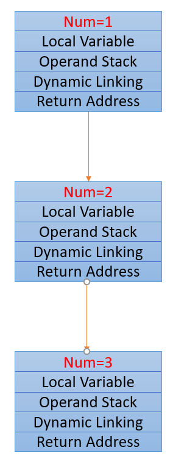

## 链表、队列、栈

1. 定义一个单链表和双端链表，都实现链表反转，同时可以实现对数器测试代码的正确性
2. 删除链表中所有的给定的value
3. 双端链表实现栈、队列数据结构
4. 数组实现队列，可以使用RingBuffer的概念
5. 栈实现getMin方法，获取最小值
6. 用栈实现队列
7. 用队列实现栈

## 递归

1. 当递归到不能分解时，会把返回值指向上个方法的栈帧的栈顶，方法回调完成递归




2. 递归算法的复杂度公式:
   $$
   T(N)=a*T(\frac{N}{b})+O(N^d) \\
   \begin{cases}
   \log_ba>d & O(N^{\log_ba}) \\
   \log_ba<d & O(N^d) \\
   \log_ba=d & O(N^d * logN)
   \end{cases}
   $$

   1. 递归实现获取数组中的最大值

   ```java
   //递归获取arr中最大值
   public static int getMax(int[] arr){
       return process(arr,0,arr.length-1);
   }
   
   public static int process(int[] arr,int L,int R){
       if(L==R) return arr[L];
       int mid=L+((R-L)>>1);
       int leftMax=process(arr,L,mid);
       int rightMax=process(arr,mid+1,R);
       return Math.max(leftMax,rightMax);
   }
   ```

   2. 分析递归的时间复杂度

      > a 代表分几次递归，代码中有2次递归，b=2
      >
      > b代表分为几等分，代码中是2等分，b=2
      >
      > d代表除了递归外的递归复杂度，代码中是O(1)，d=0
      >
      > 带人表达式，符合第一个条件，递归复杂度为O(N)

   ## 哈希表

   1. HashMap:增删改查时间复杂度都是O(1)
   2. HashSet:内部自然排序，增删改查时间复杂度是O(logN)

